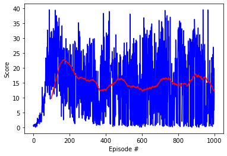

<br />
  <h3 align="center">Project 2 Continuous Control</h3>

<!-- TABLE OF CONTENTS -->
<details open="open">
  <summary>Table of Contents</summary>
  <ol>
    <li><a href="#about-the-project">About The Project</a></li>
    <li><a href="#ddpg">DDPG</a></li>
    <li><a href="#additional-parameters-in-ddpg">Additional parameters in DDPG</a></li>
    <li><a href="#ddpg-multi-agent">D4PG Multi agent</a></li>
    <li><a href="#conclusion-and-future-improvements">Conclusion and future improvements</a></li>
    <li><a href="#acknowledgements">Acknowledgements</a></li>
    <li><a href="#contact">Contact</a></li>
    <li><a href="#references">References</a></li>
  </ol>
</details>


## About The Project

 In this project an agent is trained to move an arm robot in a continuous environment. In the Reacher task, there is a ball which the robot arm must follow and touch, in other words, it needs to learn how to control and move a ball around. The longer the arm sticks to the ball, the more rewards it accumulates. The observation state of environment consists of 33 variables, and all are in continuous space. 
 
The observation space consists of 33 variables corresponding to position, rotation, velocity, and angular velocities of the arm. Each action is a vector with four numbers, corresponding to torque applicable to two joints. Every entry in the action vector is a number between -1 and 1. Here is the first difficulty: we are dealing with a continuous space in which small decimals in one of the variables can change the result drastically (from not touching to touching the ball). To see more details about the states, actions and rewards, have a look at the README. 

There are two scenarios, one being single robotic agent, and the other being multiple agents, 20 arms in total, each with their own copy of the environment. In order to be considered solved, the agents must get an average score of +30 (over 100 consecutive episodes, and over all 20 agents). In particular, after each episode, we add up the rewards that each agent received (without discounting), to get a score for each agent. This yields 20 (potentially different) scores which we average. This yields an average score for each episode (where the average is over all 20 agents). The environment is considered solved, when the average (over 100 episodes) of those average scores is at least +30.

## DDPG


In this environment it was decided to use the popular deep deterministic policy gradients (1), which is an actor-critic method. It is called deterministic, because differently from others methods like A2C, which select an action given a probability distribution, it directly provides the action given a the state. The actor decides the action, so it takes the current state as an input and return x continuous values, one for every action. Since given a state it will return always the same action, is deterministic (that is why adding noise to the action helps with exploration). The critic, estimates que Q-value (the discounted reward estimation of the action given the state). The critic takes both, action and state, and provides a number Q(s,a). Since the critic uses the action given by the actor, actor and critic are coupled. So, like in A2C, the critic is updated, but now the actor is updated to maximize the critic's function values.  

Since it is an off-policy method, now we can sample on a replay memory like in DQN, which also helps to break the correlation between transitions. Regarding the noise used in the action, Ornstein-Uhlenbeck (OU) noise (random walking noise, which grows correlated with the mean moving in a close random direction, instead of being purely gaussian) is added in action values for action exploration. 

The agent learns 20 times and updates every 40 iterations. Even of that, it was not possible, as shown in the plot, to make it stable over 30. Variability due to random seeds, neural network weight initialization and different machines can make a huge difference. There was one training that reached over 30, but when I tried to reproduce it, it was not possible to replicate the same growth.

One of the critical aspects of DDPG is the balance between explotaiton and exploration, which is indirectly affected by the OU noise. Playing with it, specially with the variance, affected a lot the stability of the algorithm. Since the noise is used to explore, we anneal it over the training, to force exploration at the beginning and convergence towards the end. 

* Learning rate - Actor: 1e-3
* Learning rate - Critic: 5e-4
* Batch Size: 256
* Buffer Size: 1e6
* Gamma: 0.99
* Tau: 1e-3
* Iterations of learning per update step: 20
* Update gradient networks step: 10
* Architecture Actor :  statex256x128xaction
* Architecture Critic : statex(256,action)x128x1
* Noise: Theta - 0.15, Sigma - 0.05


<figure>

<figcaption><i>Figure 1. Evolution of rewards (score) for the first 1000 episodes. The red line is the moving average over the last 100 episodes</i></figcaption>
 </figure>

Since the environment was not solved but the agent seemed stable enough, I decided to try with a multi-agent environment.

### Additional parameters in DDPG
* **Batch normalization**
  Batch normalization was added to the linear models to stabilize and speed up the learning.Seems to work relatively well. 
* **Repeat the number of learning times each update**
  Instead of drawing one batch each time from the replay buffer, we use a virtual batch size, ten times bigger (10 times 256). This also helped to boost the learning.
* **Adaptive learning rate**
  In order to increase the learning of the networks, the learning rate is usually decreased when it is observerd that the network cannot learn anymore. The reason is that the gradient overshoots and cannot reach the minimum on every increment of the training, so fine increments can lead better the gradient towards the minimum.  This also has an stabilizing effect on the learning. The function from pytorch _lr_scheduler.ReduceLROnPlateau_ was used, so we could start with a high learning rate and then reduce it progressively. The criteria was to use the avere score over 100 episodes, if the score of the episode was less or equal during 5 times, the learning rate was reduced by a factir 0.95. A smaller factor reduces the learning rate too much, making the learning too slow, so 0.95 was acceptable. However, when the learning rate goes below 1e-6, the learning happens too slowly, so the decrease was limited to happen between the 100 to 500 episodes.
  The positive result of using the learning rate was more stability over time. The negative is that a smaller learning rate would take longer to achieve good results.  


* **Noise update**
  The noise update was one of the critical aspects. Annealing the noise was crucial, the question was, how to anneal it? Because if the agent gets stuck at one point, more noise would be better. So when the annealing is finished (dtt == 0.001, a minimum), if we find that average score is not increasing, then, we restart the annealing for a random number of future episodes. It was also considered a patience of 5 before doing the update.
  ```
     dtt = max(0.001, 1.-(current_episode/ self.episodes_to_end))
     if dtt == 0.001:
                self.episodes_to_end = (current_episode + self.episodes_to_end) + self.episodes_to_end * np.random.random()
                self.dt = max(0.001, 1. - (current_episode / self.episodes_to_end)) ```
* **Increase TAU in soft updates every N episodes**
  The idea is to increase the amount of updating of the targets networks with a bigger TAU in the soft update, every 10 episodes. 20% of the weights was used, the reason being, that a full update of the network, gives less range of guidance for the target networks.
  ```
          if episode % 10 == 0:
            self.soft_update(self.critic_local, self.critic_target, 2e-1)
            self.soft_update(self.actor_local, self.actor_target, 2e-1)
        else:
            self.soft_update(self.critic_local, self.critic_target, TAU)
            self.soft_update(self.actor_local, self.actor_target, TAU)
  ```
* **N-steps.**
  Another improvement was to use the N-step. This was a simple implementation, which was not taken in account for the update of the gradients, just calculated the reward after certain number of steps and stored in the buffer, instead of simply add it to the buffer.
  ```   
        self.states_queue.appendleft([state, action])
        self.rewards_queue.appendleft(reward * GAMMA ** (N_STEP))
        for i in range(len(self.rewards_queue)):
            self.rewards_queue[i] = self.rewards_queue[i] / GAMMA

        if len(self.rewards_queue) >= N_STEP:
            last = self.states_queue.pop()
            self.memory.add(last[0], last[1], sum(self.rewards_queue), next_state, done)
            self.rewards_queue.pop()

        if done:
            self.states_queue.clear()
            self.rewards_queue.clear()  ```

* **Priority replay buffer**
  Finally, a PER was tried, but it did not improve the agent's learning. The implementation is commented in the agent.

## DDPG Multi-agent
With the same parameters as before, but with a normal version (none of the previous extensions), the multiagent version was tried. The modifications to the code were as it follows:
* **Main loop with N agents**
  The main loop was adapted to be used in N agents instead of 1. 
* **Shared buffer**
  The buffer was taken out from the agent and set externally, to be shared by all agents. All agents add and sample from the same buffer. Since the version is not done for multiprocessing, no special treatment was needed for the replay buffer class.


<figure>

<figcaption><i>Figure 1. Evolution of rewards (score) for the first 300 episodes. The red line is the moving average over the last 100 episodes</i></figcaption>
 </figure>

Due to the time invested on each iteration, the noise update was changed to a simplest version (epsilon decay of 0.99 at each episode)

## Conclusion and future improvements

In general, this project provides a very valuable lesson: continuous is not nice as discrete.  DDPG proved to be a really hard to use algorithm, very sensitive to random seeds, learning rates (to be specific, the right relationship between actor and critic) and the amount of noise injected for exploration. 

It took me one week to make it work for one agent stabily and for many episodes, even after reading the advice of many people in udacity forums (reduce the OU noise, repeat the learns more times, add a batch normalization to the model). The model, was though, not reaching the over 30. After another week of trials and errors on my own, out of desperation I decided to have look to other colleagues solution in github. I was astonished, how my solution and my code could be so similar to them, and the results shown so different?  So I cloned several repositories and I let them run on my computer. What a surprise when I saw that it did not work either for them. The results were not different of what I saw along my implementation: sometimes getting a nice over 30 result, sometimes not, being random most of the times. The low reproducibility in science is always a concern, so it does not say good things about the DDPG for one single agent. 

The history was very different with the multiagent. On the first day, it was already running and working. It only took to modify slightly the code provided by Udacity (ddpg-bipedal), a quick adaptation, and the goal was reached. 

DQN with rainbow proved to be quite robust, hence its success and reproduction in hundreds of repositories and blogs. However, in the branch of continuous control I still see a lot of divergence with a huge variety of algorithms aiming towards stability and reproducibility without success. And the excuse that RL is still an art, is not enough for me. I am though, hopeful that we will find better algorithms and solutions in the future!

List of improvements:
* Use D4PG (2). The core idea is to replace a single Q-value from the critic with a probability distribution. The solution seems quite challenging to implement, but in the paper they claim it provides better results than DPPG. 
* Use Noisy Networks, it could help to explore better and enhance the learning (3).
* Would be also interesting to use PPO(4)


## Acknowlegments


## Contact

Jose Miguel Serra Lleti - serrajosemi@gmail.com

Project Link:

## References
* (1) [DDPG](https://arxiv.org/pdf/1509.02971.pdf)
* (2) []()
* (3) [Noisy networks](https://arxiv.org/pdf/1706.10295.pdf)
* (4) [PPO](https://openai.com/blog/openai-baselines-ppo/). 
